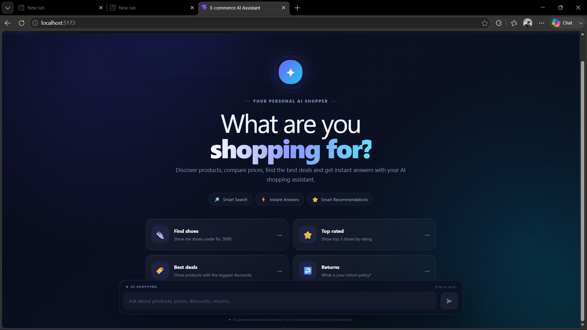
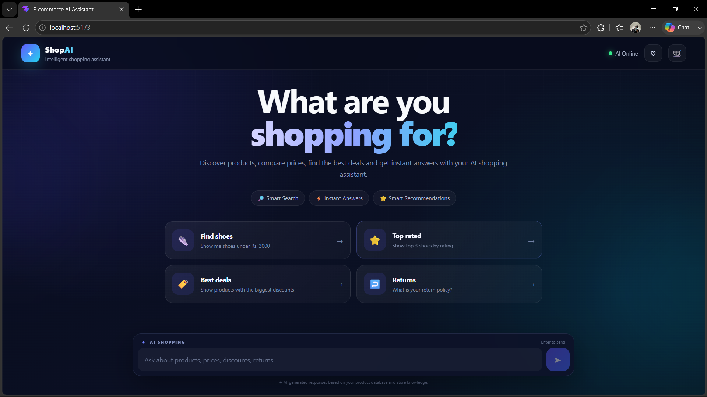
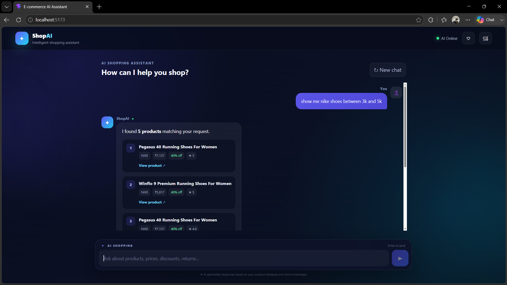
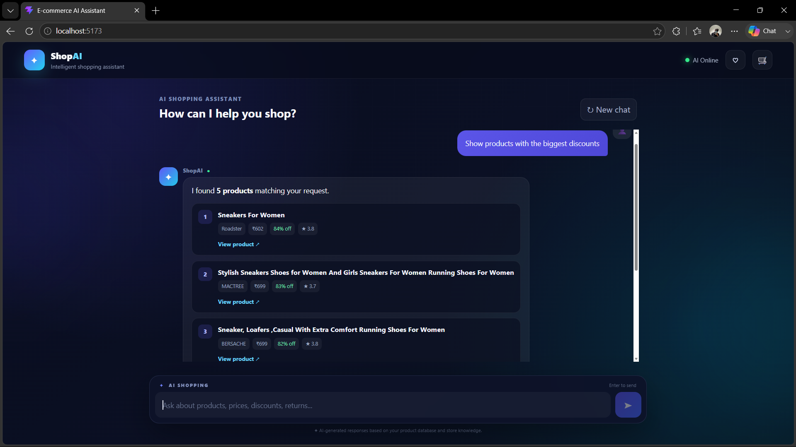
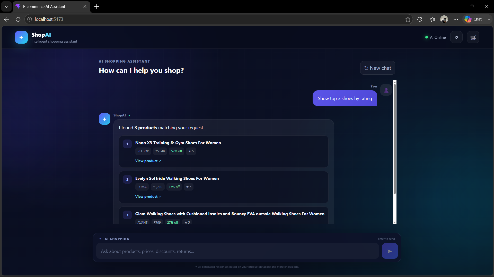
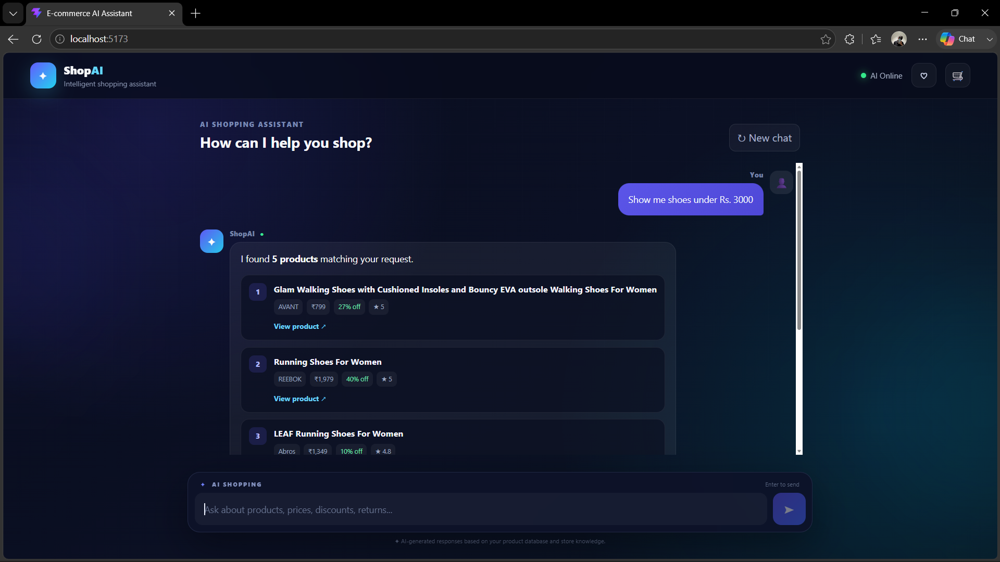
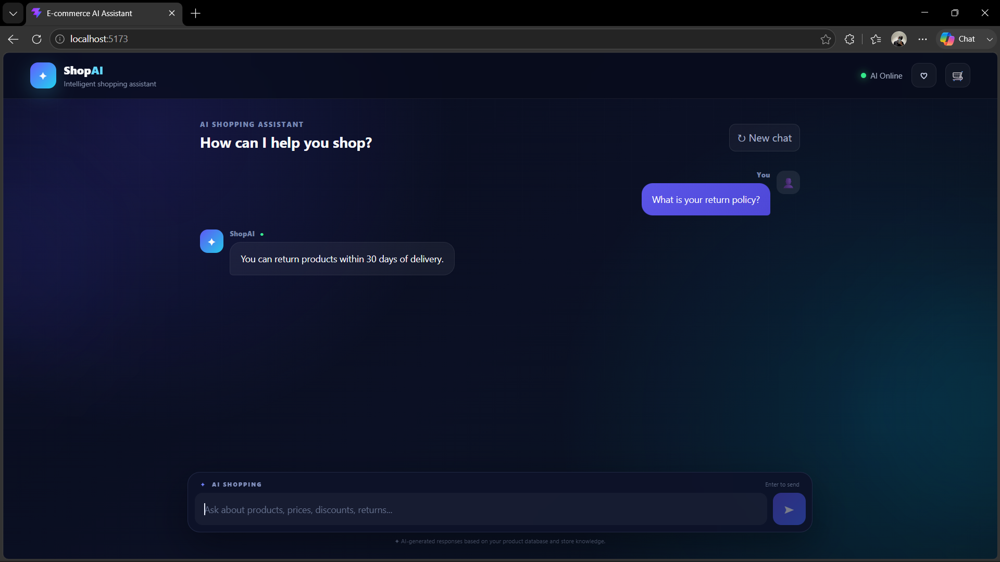
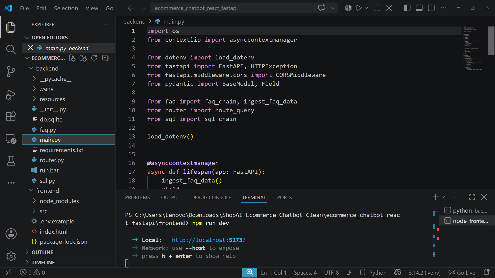

# 🛒 ShopAI — E-Commerce AI Chatbot

An AI-powered e-commerce chatbot built with **React, FastAPI, SQLite, Groq, and TF-IDF**.

ShopAI allows users to search and explore products using natural language. It can retrieve products based on price, brand, discount, rating, and category, while also answering common e-commerce FAQs.

---

## 📸 Screenshots

### 🏠 Home Page



### 💬 Chatbot Interface



### 🔎 Product Search



### 🏷️ Discount Search



### ⭐ Top Products by Rating



### 👟 Products Under ₹3000



### ❓ FAQ Retrieval



### 💻 Backend



---

## ✨ Features

- 🤖 AI-powered e-commerce chatbot
- 🔎 Natural-language product search
- 🛍️ Product retrieval with clickable product links
- 💰 Search by price and price range
- 🏷️ Filter by brand and discount
- ⭐ Sort products by rating
- ❓ FAQ retrieval using TF-IDF
- 🗄️ SQLite product database
- ⚡ FastAPI backend
- ⚛️ React + Vite frontend
- 🧠 Optional Groq LLM responses
- 🌐 Product data collected through web scraping

---

## 🧠 How It Works

```text
User
 │
 ▼
React Frontend
 │
 ▼
FastAPI Backend
 │
 ├── Product Query ──► SQLite Database
 │
 ├── FAQ Query ─────► TF-IDF Retrieval
 │
 └── AI Response ───► Groq LLM
 │
 ▼
React Response

Product retrieval uses parameterized SQL queries instead of relying on LLM-generated SQL, making the results more deterministic and reliable.

The FAQ system uses local TF-IDF retrieval, while Groq can optionally generate natural-language responses.

🛠️ Tech Stack
Category	Technologies
Frontend	React, JavaScript, Vite, CSS
Backend	Python, FastAPI, Uvicorn
AI	Groq, Llama 3.3 70B
Retrieval	TF-IDF, Scikit-learn
Database	SQLite, SQL
Data Collection	Web Scraping
Tools	Git, GitHub, VS Code
📂 Project Structure
ecommerce_chatbot_react_fastapi/
│
├── frontend/          # React frontend
├── backend/           # FastAPI backend
├── web-scrapping/     # Product data collection
├── screenshots/       # Project screenshots
├── .gitignore
└── README.md

The project currently contains approximately 903 products in the SQLite database.

💬 Example Queries
Product Queries
Show products with the biggest discounts
Show me Nike shoes under Rs. 3000
Show top 3 shoes by rating
Find products between 2000 and 5000
Find Puma products
FAQ Queries
What is your return policy?
How can I track my order?
What payment methods are accepted?
🚀 Run Locally
Backend
cd backend
py -3 -m venv .venv
.venv\Scripts\Activate.ps1
pip install -r requirements.txt

Create backend/.env:

GROQ_API_KEY=your_groq_api_key
GROQ_MODEL=llama-3.3-70b-versatile
FRONTEND_URL=http://localhost:5173

Start the backend:

python -m uvicorn main:app --reload --host 127.0.0.1 --port 8000

API documentation:

http://127.0.0.1:8000/docs
Frontend

Open another terminal:

cd frontend
npm install
npm run dev

Open the Vite URL, normally:

http://localhost:5173
🔐 Security
API keys are stored in .env
.env is excluded from Git
SQL queries are parameterized
.venv and node_modules are excluded from Git
Previously exposed API keys should be revoked and replaced

Never commit API keys or passwords to GitHub.

🔮 Future Improvements
🛒 Shopping cart
❤️ Wishlist
👤 User authentication
💳 Payment integration
🧠 Personalized recommendations
🎙️ Voice-based shopping
📊 Admin dashboard
☁️ Cloud deployment
👨‍💻 Author

👨‍💻 Author

Jiya S Jain
Data Science & GenAI Enthusiast

🔗 GitHub: https://github.com/jiya426
🔗 LinkedIn: https://www.linkedin.com/in/jiya-jain9876/

⭐ If you like this project, consider giving it a star on GitHub.


